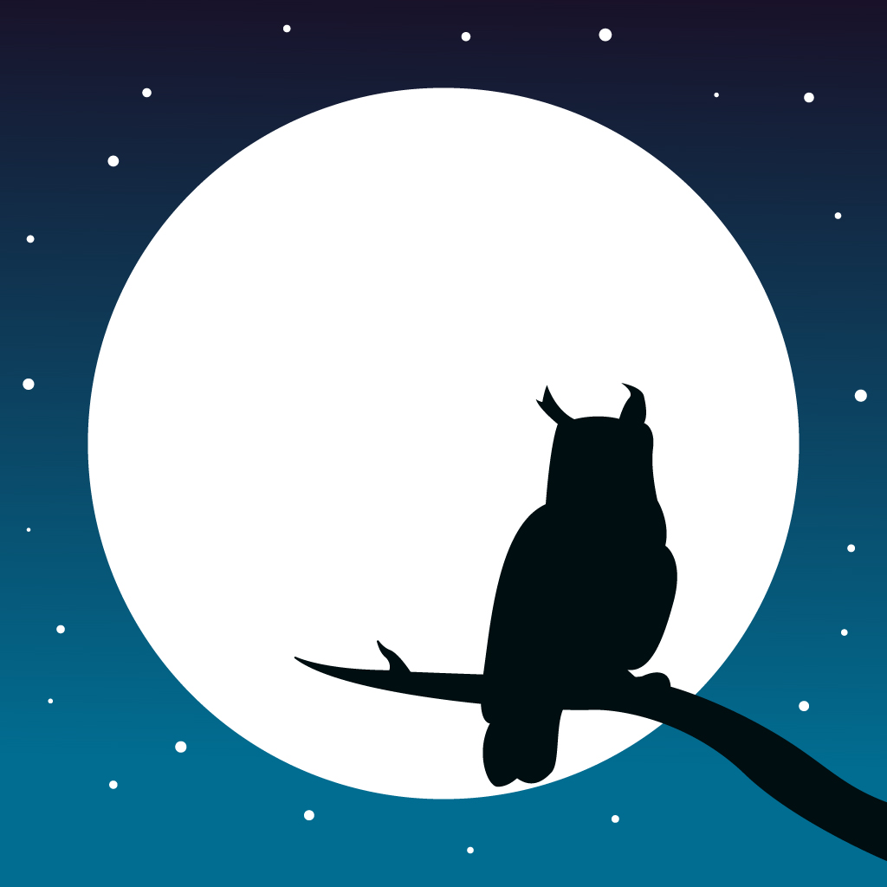

# Moonlight

## About

Moonlight is an app that could help you with your sleep apnea or upper airway resistance syndrome.

It works by offering a gentle vibration or chime anytime you roll towards your back.

## Further Reading

For more information on why this is relevant, please see this [blog post](https://rob-culliton.medium.com/a-short-history-of-positional-sleep-apnea-hacks-6b6230fca433)

To learn more about the interactions of sleep position, heart rate, and oxygen saturation, check out [this post.](https://rob-culliton.medium.com/patterns-of-sleep-position-sp02-d6c185c9559f)

## Download

Currently available for free on the Google [Play Store](https://play.google.com/store/apps/details?id=com.robertculliton.moonlight)

